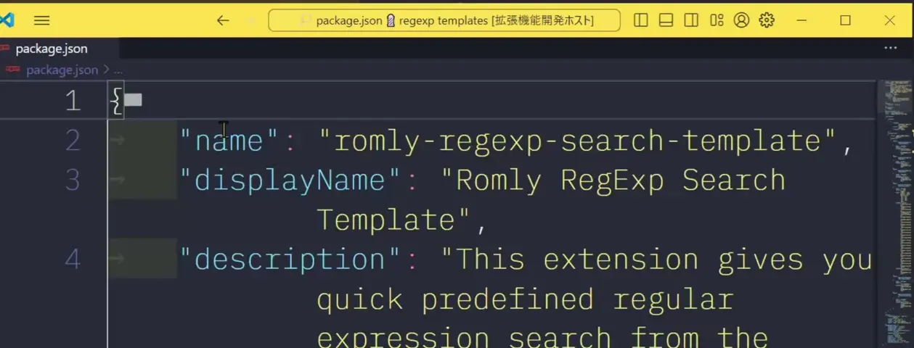

# Romly Toggle Wordwrap

## 日本語(Japanese)

[English is here](#english英語)

行の折り返し設定を on/off で切り替える拡張機能です。いちいち設定画面に行かずとも、コマンドパレットから呼び出してサクッと切り替えられるようになります。

### 使い方

コマンドパレットから `toggle wordwrap` などとタイプして検索し、実行して下さい。ショートカットを割り当てて使うのも便利かもしれませんね！

### 拡張機能の設定

ありません！

### リリースノート

変更ログ [CHANGELOG.md](CHANGELOG.md) をご覧下さい。

-----

## English(英語)

[日本語(Japanese)はこちら](#日本語japanese)

This extension lets you toggle the word wrap setting on/off. No need to dig through settings anymore, just call it up from the command palette.

### How to Use

Just type `toggle wordwrap` or somethin in the command palette and execute it. Setting a shortcut for this also might also be handy.

### Extension Settings

Nothing!

### Release Notes

Please check [CHANGELOG.md](CHANGELOG.md) for the details.